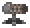

# MoreMechanisms
 
Terraria mod that adds more mechanisms and sensors.

Currently tested with Terraria v1.3.5.2, [tModLoader](https://github.com/tModLoader/tModLoader/) v0.11.6.2. 
Once tModLoader updates for 1.4, this mod will target 1.4.
See the [Releases](https://github.com/PieKing1215/MoreMechanisms/releases) tab for builds.

Licensed under the [GNU Lesser General Public License v3.0 (GNU LGPLv3)](LICENSE).

## Additions

###  Entity Sensor
Upgraded player above sensor with configurable zone and entity filter.
  
###  Speaker
Plays a selected sound when powered.
  
###  Itemduct
Automatically transfer items between containers.
  
###   Quarry
Place Quarry Scaffold tiles and a Quarry to automatically mine tiles using a pickaxe.
  
###  Vacuum
Picks up dropped items which can be pulled into Itemducts.
  
###  Turret
Automatically shoots enemies using bullets.
  
###  Seller
Automatically sells items placed inside.
  
###  Dropper
Drops items into the world when activated.

###  Delay Circuit
When the left side is activated, activates the right side after a delay.
  
###  Invasion Sensor
Sends a signal when an invasion starts and ends.
  
###  Blood Moon Sensor
Sends a signal when a blood moon starts and ends.
  
###  Solar Eclipse Sensor
Sends a signal when a solar eclipse starts and ends.

## Changes
### The Grand Design
When The Grand Design is in your inventory, you gain an additional 12 inventory slots only for mechanisms.
